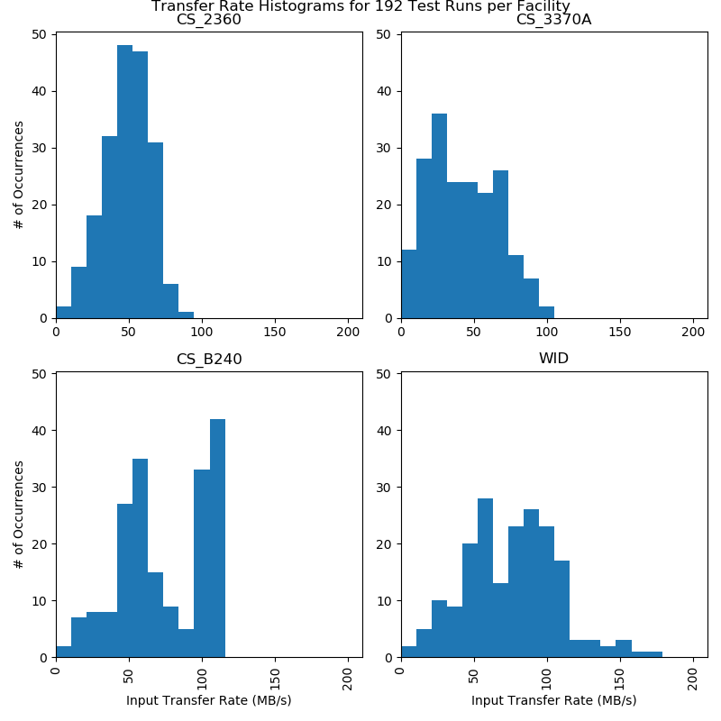
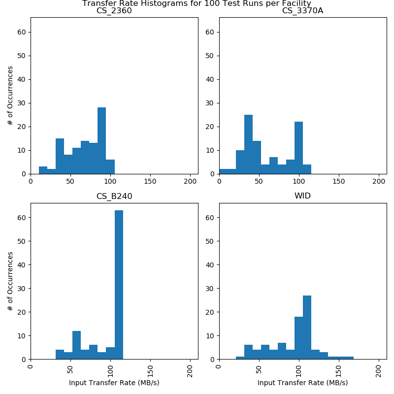
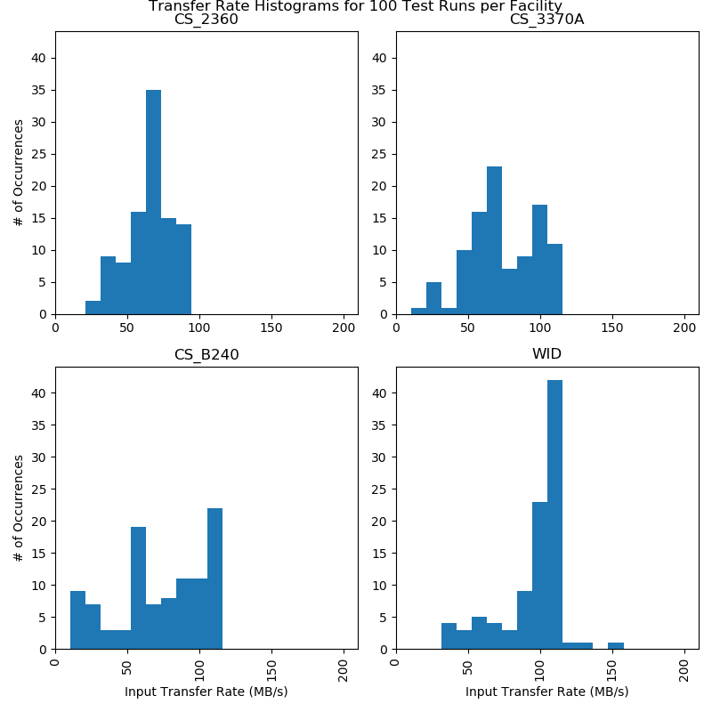

# CHTC Transfer Test Results

Note that these tests are generally not run concurrently, and that they are run
over very long timespans. Ephemeral problems should be averaged out, but only
over ~hour timescales. Problems that persist for days or weeks will show up in
the data.

## From `submit-1`

`submit-1` is physically located in CS 3370A.

```
transfer_input_rate (MB/s)
                        mean   q05   q25   q50    q75    q95
Facility
CS_2360                 49.2  19.6  40.0  50.0   61.0   72.4
CS_3370A                42.6  10.1  23.4  38.9   61.5   80.3
CS_B240                 73.3  22.9  51.0  67.8  104.4  108.1
WID                     77.9  25.0  53.8  77.0   99.6  131.1
```



## From `submit1` SSD Drive

`submit-1` has an SSD drive attached to it, currently mounted directly to 
`/var/lib/condor/spool`. These jobs were run with the test file in that directory.

```
transfer_input_rate
                        mean   q05   q25    q50    q75    q95
Facility
CS_2360                 67.9  32.8  51.7   73.1   88.3   94.8
CS_3370A                60.6  22.6  37.2   44.9   95.0  102.5
CS_B240                 93.3  51.0  78.5  106.7  107.8  111.3
WID                    124.3  36.0  78.6  105.0  111.6  365.7
```



## From `submit2`

`submit-2` is physically located in WID.

```
transfer_input_rate (MB/s)
                        mean   q05   q25    q50    q75    q95
Facility
CS_2360                 69.1  33.2  56.6   68.7   77.1   88.3
CS_3370A                73.9  29.1  56.6   70.9   96.8  108.9
CS_B240                 73.1  18.7  56.3   74.5  100.4  110.1
WID                    100.8  43.3  92.9  104.5  107.8  137.6
```


